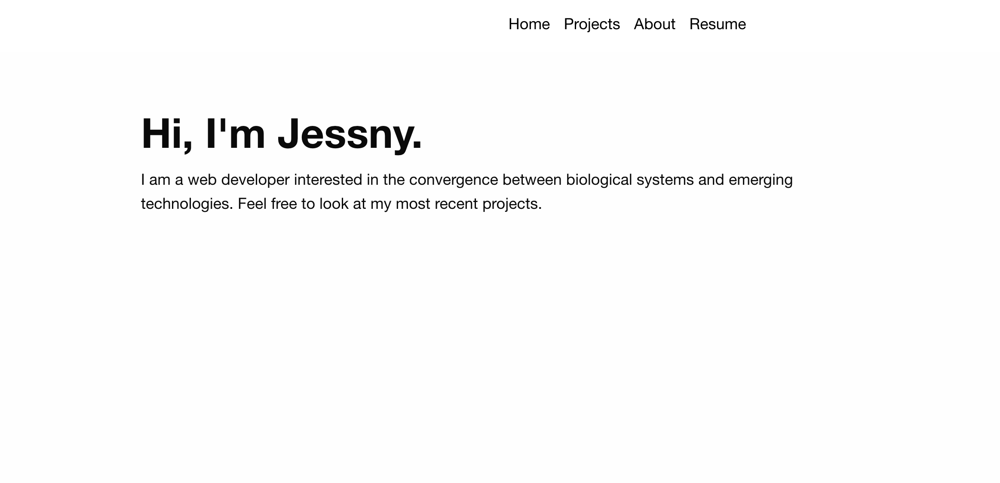
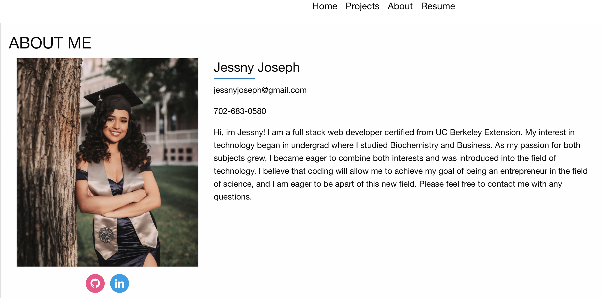

# jessny-portfolio

## Site Picture



## Technologies Used

* HTML
* CSS
* Javascript
* Foundation

## Summary
Within my portfolio I have an About me section, my Projects section highlighting my best work, and a Resume section with a downloadable pdf of my resume.

## Deployed Link

* [See Live Site] (https://jessnyj.github.io/jessny-portfolio/)

## Work Involved
I created a my portfolio site utilizing the Foundation CSS Framework. I created the different
pages utilizing javascript.

 ## Code Snippet
 ```
 // ProjectButton
$("#projectButton").on("click", function(event){
    event.preventDefault();
    $("#display-about").empty();
    displayProject();

});

// About Button
$("#aboutButton").on("click", function(event) {
    event.preventDefault();
    $("#display-project").empty();
    displayAboutMe();
});
```


## Authors
**UC Berkeley Coding Bootcamp**

**Jessny Joseph** 
- [Link to Github](https://github.com/jessnyj)
- [Link to LinkedIn](https://www.linkedin.com/in/jessny-joseph-361515201)


## Acknowledgments
Trilogy Education Services
